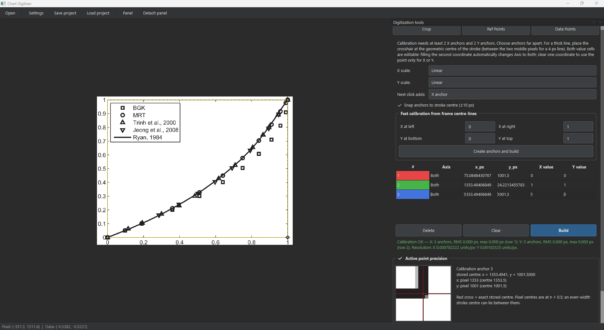
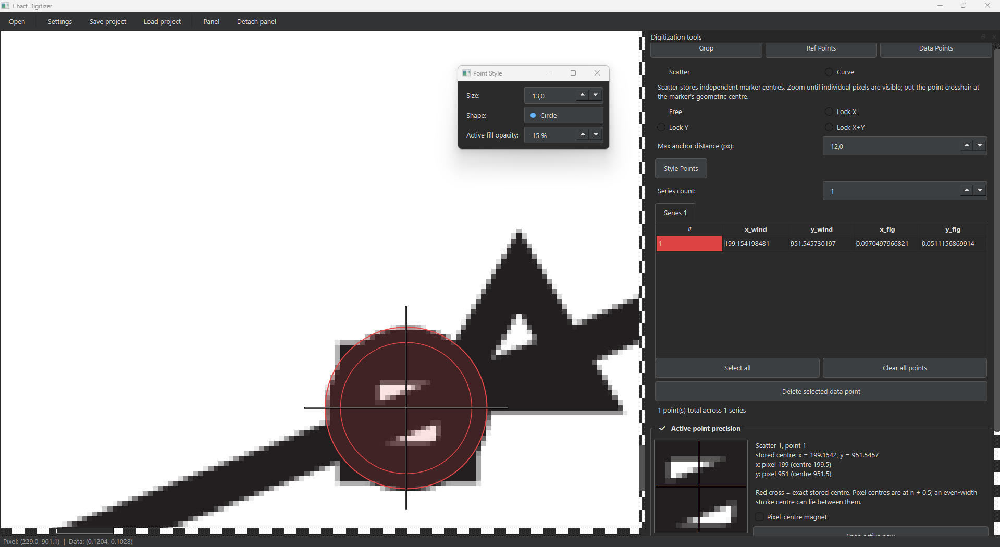
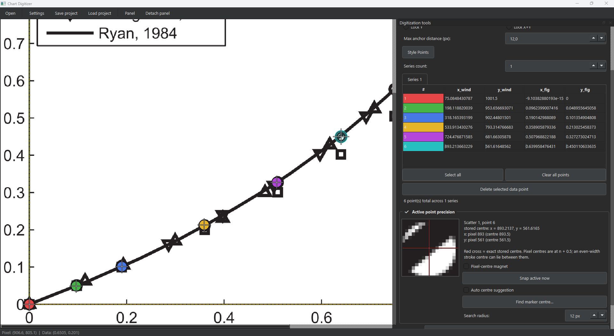
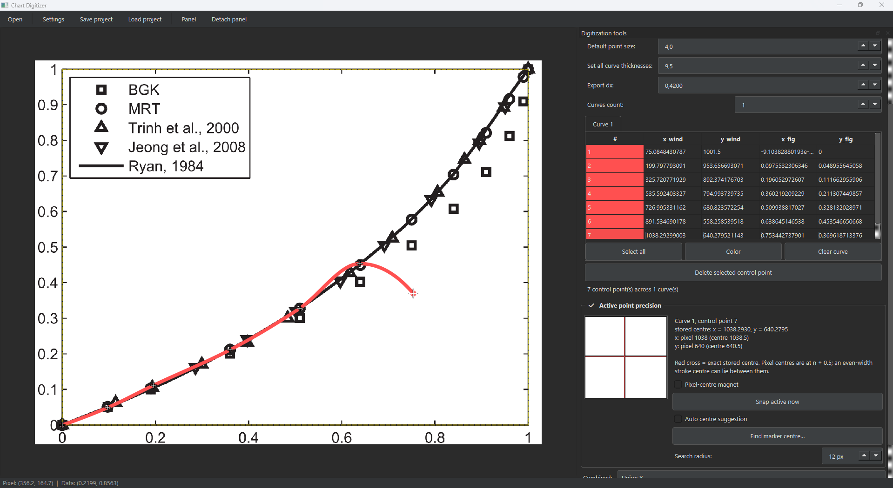

# Chart digitizer

Приложение для извлечения числовых данных из изображений двумерных графиков. Ручной режим работы с визуальными инструментами для приближенного оцифровывания кривых и точек. Прототип.

## Возможности

- **Автоматическое определение области графика** — анализ контуров и линий Хафа
- **Ручная расстановка референсных точек** — задание известных координат для калибровки осей
- **Линейные и логарифмические шкалы** для обеих осей
- **Референсная сетка** — автоматическое построение сетки на основе калибровочных точек
- **Два режима данных: Scatter и Curve**
  - **Scatter** — дискретные точки с привязкой к сетке (Snap X / Snap Y), настраиваемая форма/размер и прозрачность активной точки, pixel-centre magnet и подтверждаемый поиск центра маркера
  - **Curve** — контрольные точки для однозначной `y(x)`, единая для preview и экспорта shape-preserving PCHIP-интерполяция (в log-пространстве для log-осей), отдельные `Style Points` (включая прозрачность активной точки) и `Curve Style` (цвет, толщина, шаблон линии)
- **Множественные серии** — независимые вкладки для серий точек и кривых
- **Таблицы координат** — редактирование пиксельных и данных координат вручную
- **Перемещение точек** — мышью, стрелками клавиатуры и вводом в таблицу
- **Управление областью обрезки** — перетаскиваемые углы прямоугольника с синхронизацией рёбер
- **Масштабирование и панорамирование** — колесо мыши (zoom), ПКМ (pan)
- **Экспорт в Excel** — отдельные листы по сериям, комбинированная таблица, метаданные
- **Сохранение/загрузка сессии** — файлы `.digitizer`
- **Dock-панель инструментов** — ширина меняется перетаскиванием границы;
  панель полностью скрывается (`Panel`, `Ctrl+B`), открепляется в отдельное
  окно (`Detach panel`) и возвращается обратно без уменьшения холста
- **Тёмная тема** — стилизация через QSS

## Требования

- Python 3.10+
- Windows 10/11

## Копирование репозитория через Git

```bash
git clone https://github.com/ChumarinGA/Chart-digitizer.git
cd Chart-digitizer
```

## Установка

```bash
pip install -r requirements.txt
```

## Запуск

```bash
python -m src.main
```

## Порядок работы

1. **Загрузка изображения** — перетащите PNG/JPEG в окно или нажмите кнопку Open
2. **Crop** — определите область графика (автоматически или вручную). Углы прямоугольника редактируются перетаскиванием, стрелками или через таблицу координат
3. **Ref Points** — расставьте референсные точки на известных значениях осей, укажите тип шкалы (линейная/логарифмическая), постройте калибровку
4. **Data Points (Scatter)** — добавляйте дискретные точки кликом на график. Общая лупа показывает центр активной точки, а не курсор; Snap X/Y, pixel-centre magnet и подтверждаемый Marker Centre включаются независимо
5. **Data Points (Curve)** — ставьте контрольные точки, через которые строится гладкая кривая. Задайте шаг dx для дискретизации при экспорте. Настраивайте контрольные точки через `Style Points`, а линию через `Curve Style`
6. **Export** — сохраните данные в Excel (.xlsx)

Если элементы панели не помещаются по высоте, используйте её вертикальную
прокрутку. Блок `Active point precision` можно свернуть флажком в заголовке;
при узкой панели лупа и её инструменты автоматически располагаются вертикально.

## Точность калибровки

- Минимум — **2 опоры по X и 2 опоры по Y**. Обычно это четыре независимых
  клика; две диагональные точки допустимы лишь когда в каждой точно известны и
  X, и Y.
- Для контроля ошибки рекомендуется 3–5 опор на ось: приложение показывает
  RMS и максимальный остаток в пикселях.
- На рамке толщиной 4 px центр крестика ставится на **среднюю линию штриха** —
  между двумя средними пикселями, а не на внутренний/внешний край.
- Auto Crop уточняет средние линии рамки до субпиксельной координаты;
  подтверждённый жёлтый контур остаётся видимым на Ref/Scatter/Curve без
  закрашивания изображения. Лупа следует за сохраняемым центром активной точки,
  а не за курсором.
- X- и Y-опоры независимы. Любое их изменение немедленно инвалидирует старую
  калибровку, поэтому неверное преобразование не используется молча.
- В ref-таблице обе колонки значений доступны одним кликом; заполнение второй
  координаты автоматически меняет роль опоры на `Both`, а очистка возвращает
  `X` или `Y`.
- Preview и экспорт Curve используют один PCHIP в пространстве осей; повторные
  X отклоняются, а обе крайние точки всегда входят в экспорт.

Подробная инструкция и ограничения: [docs/ACCURACY_GUIDE_RU.md](docs/ACCURACY_GUIDE_RU.md).
Результаты технического аудита: [docs/AUDIT_REPORT_RU.md](docs/AUDIT_REPORT_RU.md).

## Структура проекта

```
src/
  main.py                    Точка входа
  core/                      Алгоритмы (без зависимости от GUI)
    calibration.py           Преобразование пиксель <-> данные
    preprocessing.py         Предобработка изображений
    plot_area.py             Обнаружение области графика
    export.py                Экспорт в Excel
    project.py               Сохранение/загрузка сессии
  models/                    Структуры данных
    types.py                 Перечисления (ScaleType, SeriesKind и др.)
    calibration_data.py      RefPoint, CalibrationResult
    series_data.py           ExtractedPoint, SeriesData
    project_data.py          AppSettings, ProjectState
  gui/                       Интерфейс PySide6
    app.py                   Настройка QApplication
    main_window.py           Главное окно
    start_screen.py          Стартовый экран с drag-and-drop
    image_canvas.py          Масштабируемый просмотрщик
    mode_panel.py            Панель режимов (Crop / Ref / Data)
    point_table.py           Таблицы точек и углов обрезки
    style_dialog.py          Диалог стиля точек
    settings_dialog.py       Настройки приложения
    overlays/                Визуальные наложения
      crop_overlay.py        Прямоугольник обрезки
      point_overlay.py       Перетаскиваемые точки
      ref_grid_overlay.py    Референсная сетка
      curve_path_overlay.py  Отображение выборки единого Curve-интерполятора
  resources/
    styles/
      dark.qss               Тёмная тема, включаемая в устанавливаемый пакет
```

## Скриншоты работы

### Стиль активной точки

Цветная рамка и регулируемая полупрозрачная заливка показывают точный центр
устанавливаемой Scatter- или Curve-точки.



### Точная оцифровка Scatter

Лупа следует за сохранённым центром активной точки; рядом доступны
pixel-centre magnet и подтверждаемый поиск центра маркера.



### Оцифровка Curve

Контрольные точки и итоговая PCHIP-кривая отображаются вместе с инструментами
точного позиционирования.




## License

This project is licensed under the MIT License.
